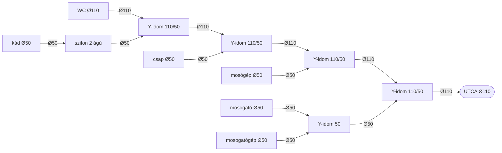

# Csatornaterv
_Dátum: 2026-03-09_

## Rétegrend
A csatornacső a vízszigetelés felett, az XPS hőszigetelésbe ágyazva fut (15cm mozgástér).

## Sematikus ábra

```
UTCA
  │
 Ø110
  │
Y-idom 110/50 ──── Ø50 ──── Y-idom 50 ───── [mosogató Ø50]
  │    KONYHA                     └────────── [mosogatógép Ø50]
 Ø110
  │
Y-idom 110/50 ──── Ø50 ───────────────────── [mosógép Ø50]
  │    FÜRDŐSZOBA
 Ø110
  │
Y-idom 110/50 ──── Ø50 ───────────────────── [csap Ø50]
  │
 Ø110
  │
Y-idom 110/50 ──── Ø50 ── [szifon 2 ágú] ── [kád Ø50]
  │
 Ø110
  │
[WC Ø110]
```

## Mermaid diagram



## Megjegyzések
- A meglévő 110-es csatornacső mélysége megfelelő, újrahasználható
- A fürdőszobai Ø110 ág visszavezet a konyhai Y-idom 110/50-re, onnan megy az UTCA felé

## Alkatrészek
https://www.praktiker.hu/epites-felujitas/szerelesi-anyag-cso-idom/szifon-lefolyotechnika/styron-sty-502-1-szuezszifon-2-agu-muanyag/p/332814

### 110-es idom
https://www.praktiker.hu/epites-felujitas/szerelesi-anyag-cso-idom/pvc-es-kg-lefolyocso-idom/stebo-lefolyoag-sb-pp-110/50x45/p/228693
https://www.praktiker.hu/epites-felujitas/szerelesi-anyag-cso-idom/pvc-es-kg-lefolyocso-idom/stebo-t-idom-lefolyocsohoz-sb-pp-110/50x87-t-idom/p/228695

### 50-es idom
https://www.praktiker.hu/epites-felujitas/szerelesi-anyag-cso-idom/pvc-es-kg-lefolyocso-idom/stebo-lefolyoag-sb-pp-50/50x45/p/228691
https://www.praktiker.hu/epites-felujitas/szerelesi-anyag-cso-idom/pvc-es-kg-lefolyocso-idom/stebo-lefolyo-iv-sb-pp-50x45/p/228702
